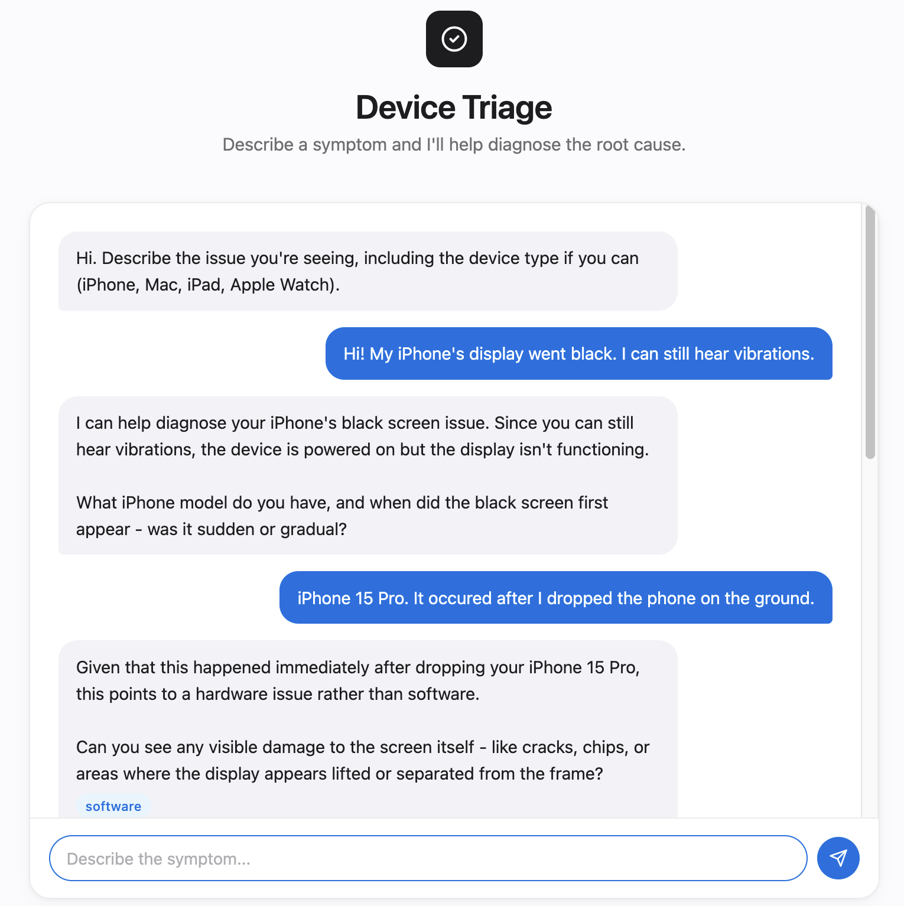
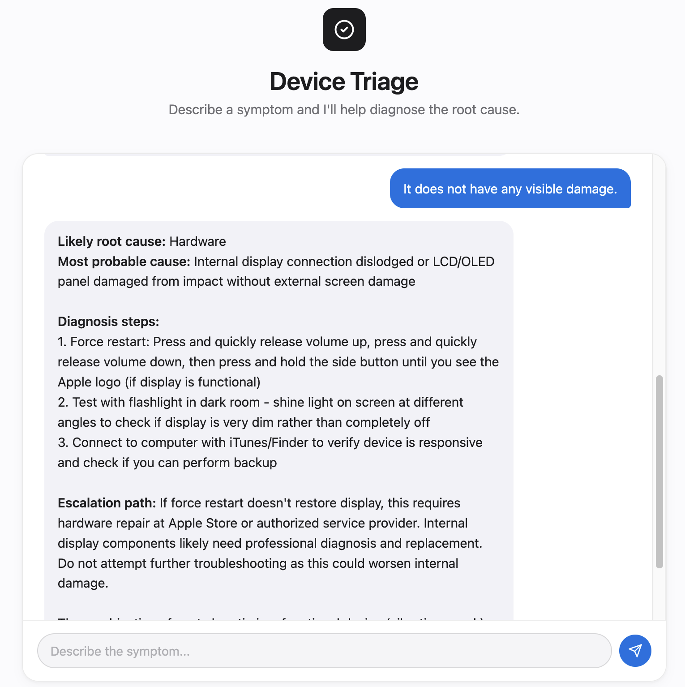
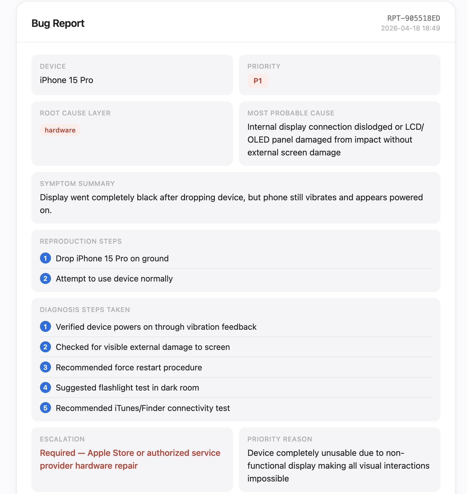

# Device Triage Assistant

An AI-powered device triage tool that diagnoses Apple device issues through dynamic multi-turn conversations and generates structured bug reports.

I built it as a personal project to demonstrate agentic AI workflows, prompt engineering, and full-stack development.

---

## Funtionalities - What it does?

- Accepts a device symptom in plain language
- Conducts a structured diagnostic conversation and will ask one targeted clarifying question at a time.
- Searches a knowledge base of common issues to inform its questions and diagnosis
- Delivers a structured diagnosis identifying root cause layer (software / hardware / configuration / integration), probable cause, steps, and escalation path
- Generates a formatted bug report with priority level (P1/P2/P3), reproduction steps, diagnosis steps taken, escalation recommendation, and resolution suggestion
- Saves all reports locally as JSON for case history tracking

---

## How the agentic workflow works?

1. User describes a symptom
2. App searches the knowledge base for keyword matches and attaches relevant entries as context
3. Full conversation history + knowledge base context is sent to Claude with a triage system prompt
4. Claude decides whether to ask another clarifying question or deliver a diagnosis
5. Once diagnosis is detected, the Generate Report button activates
6. Clicking it sends the full conversation to Claude with a separate report-writing prompt
7. Claude returns structured JSON which is rendered in the UI and saved locally

The agent reasons across the full conversation, not just the last message. The more context it gathers, the more accurate its diagnosis becomes.

---

## Demo

**Example triage session:**




After diagnosis, clicking **Generate bug report** produces:



---

## Tech stack

| Layer | Technology |
|---|---|
| Backend | Python, Flask |
| AI agent | Anthropic Claude API (claude-sonnet) |
| Knowledge base | JSON (extensible) |
| Frontend | HTML, CSS, Vanilla JavaScript |
| Report storage | Local JSON files |

---

## Setup

**1. Clone the repo**
```bash
git clone https://github.com/yourusername/device-triage.git
cd device-triage
```

**2. Install dependencies**
```bash
pip install -r requirements.txt
```

**3. Set your Anthropic API key**
```bash
export ANTHROPIC_API_KEY=your_key_here
```
Get a free API key at [console.anthropic.com](https://console.anthropic.com)

**4. Run the app**
```bash
python app.py
```

**5. Open in browser**
```
http://localhost:5000
```
---

## Extending the knowledge base

Add entries to `knowledge_base.json` following this format:

```json
{
  "id": "unique-id",
  "device": "iPhone",
  "symptom": "short description",
  "keywords": ["keyword1", "keyword2"],
  "causes": ["cause1", "cause2"],
  "diagnosis_steps": ["step1", "step2"],
  "escalation": "when and how to escalate",
  "layer": "software"
}
```

`layer` must be one of: `software`, `hardware`, `configuration`, `integration`

---

## Why I built this

I've spent 4+ years as a Certified Technician diagnosing device issues across macOS, iOS, iPadOS, and watchOS. The triage process of asking the right questions, narrowing root cause, documenting findings is something I do every day. This project translates that workflow into an AI agent, and explores how generative AI can augment and accelerate technical support triage.
